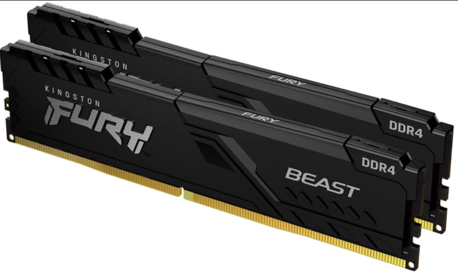
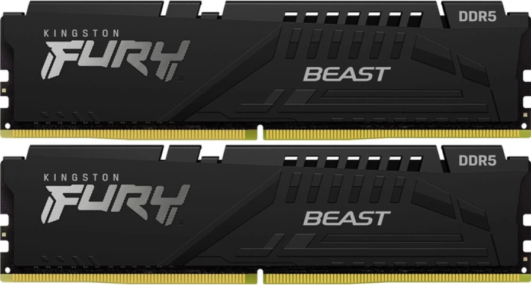

# Тема 3. Порівняння оперативної пам’яті типів DDR4 та DDR5

## 1. Характеристики оперативної пам’яті

### 📌 :contentReference[oaicite:0]{index=0} (DDR4)

- **Тип пам’яті:** DDR4 SDRAM :contentReference[oaicite:1]{index=1}  
- **Обсяг:** 16 ГБ (2×8 ГБ) :contentReference[oaicite:2]{index=2}  
- **Частота:** 3200 МГц :contentReference[oaicite:3]{index=3}  
- **Таймінги:** CL16-18-18 :contentReference[oaicite:4]{index=4}  
- **Напруга:** ~1.35 В :contentReference[oaicite:5]{index=5}  
- **Форм-фактор:** 288-pin UDIMM :contentReference[oaicite:6]{index=6}  
- **Охолодження:** Низькопрофільний радіатор :contentReference[oaicite:7]{index=7}  
- **Профілі XMP:** підтримка профілю Intel XMP :contentReference[oaicite:8]{index=8}

---

### 📌 :contentReference[oaicite:9]{index=9} (DDR5)

- **Тип пам’яті:** DDR5 SDRAM :contentReference[oaicite:10]{index=10}  
- **Обсяг:** 32 ГБ (2×16 ГБ) :contentReference[oaicite:11]{index=11}  
- **Частота:** 5600 МГц :contentReference[oaicite:12]{index=12}  
- **Таймінги:** CL40 :contentReference[oaicite:13]{index=13}  
- **Напруга:** ~1.25 В :contentReference[oaicite:14]{index=14}  
- **Форм-фактор:** 288-pin UDIMM :contentReference[oaicite:15]{index=15}  
- **Ефективна пропускна здатність:** ~44800 МБ/с :contentReference[oaicite:16]{index=16}  
- **Особливості:** Покращене теплове охолодження, вища пропускна здатність :contentReference[oaicite:17]{index=17}

---

## 2. Порівняння DDR4 vs DDR5

| Параметр | DDR4 (3200) | DDR5 (5600) |
|----------|-------------|-------------|
| **Тип пам’яті** | DDR4 SDRAM | DDR5 SDRAM |
| **Частота** | 3200 МГц | 5600 МГц |
| **Обсяг модулів** | 16 ГБ (2×8) | 32 ГБ (2×16) |
| **Таймінги (CAS Latency)** | CL16-18-18 | CL40-40-40 |
| **Пропускна здатність** | ~25600 МБ/с | ~44800 МБ/с |
| **Напруга** | ~1.35 В | ~1.25 В |
| **Підтримка XMP** | Так | Так |
| **Ефективність енергії та продуктивність** | Базова | Вища, оптимізована |

### 🔎 Основні відмінності

- **Швидкість:** DDR5 працює на значно вищій частоті, що забезпечує більшу пропускну здатність, особливо важливо в сучасних іграх і при важких задачах.  
- **Енергоефективність:** DDR5 працює на нижчій напрузі, що знижує енергоспоживання.  
- **Продуктивність:** Вища частота і оптимізовані механізми управління даними дають DDR5 перевагу в мультизадачності та 3D-рендерингу.

---

## 3. Висновки

Оперативна пам’ять **DDR5** має суттєву перевагу перед **DDR4** по швидкості та пропускній здатності, що робить її більш перспективним вибором для сучасних систем. Разом з тим **DDR4** залишається хорошим варіантом для бюджетних збірок та сумісних платформ.

---

## 4. Джерела зображень

### Зовнішній вигляд Kingston Fury DDR4

### Зовнішній вигляд Kingston Fury DDR5

---
