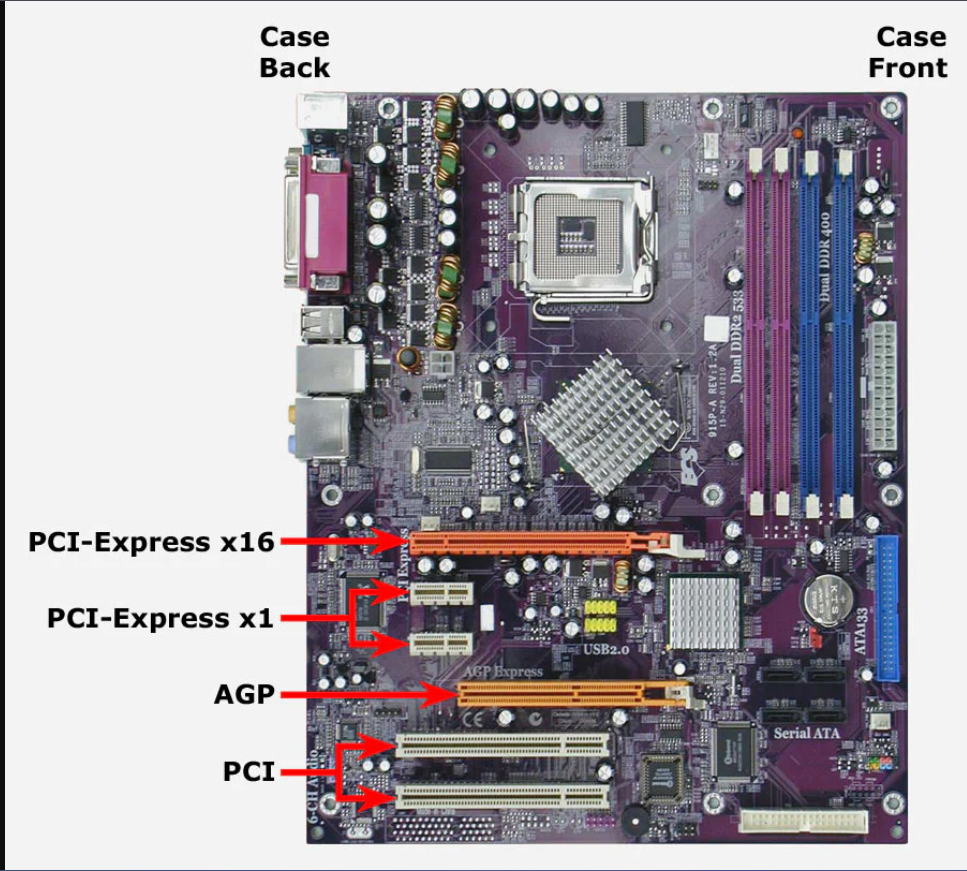
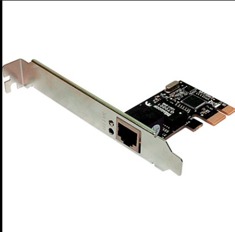
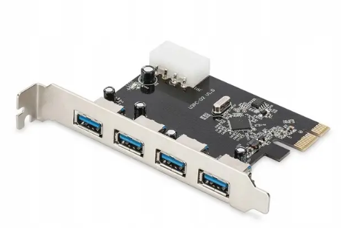
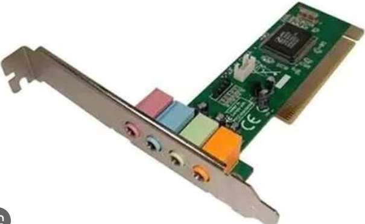
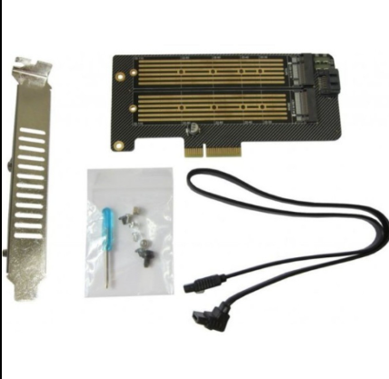
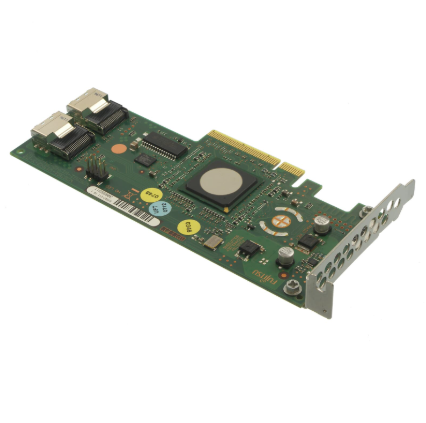
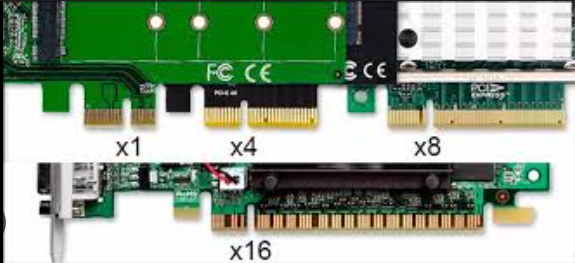
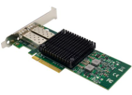
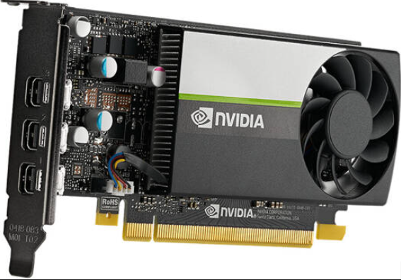

# Тема 4. Слоти розширення материнської плати та карти розширення PCI-e

## Мета роботи
Ознайомитися з основними типами слотів розширення материнської плати, їх характеристиками, а також розглянути карти розширення, що використовують інтерфейс PCI-Express.

---

## 1. Огляд та характеристики слотів розширення (Expansion Slots)

Слоти розширення використовуються для підключення додаткових пристроїв до материнської плати комп’ютера. Вони дозволяють встановлювати відеокарти, мережеві адаптери, звукові карти, контролери та інші компоненти.

### Основні типи слотів PCI-Express

| Тип слоту | Довжина | Пропускна здатність | Призначення |
|-----------|--------|---------------------|-------------|
| PCI-e x1  | Малий  | Низька              | Мережеві карти, USB-контролери |
| PCI-e x4  | Середній | Середня            | SSD-контролери, RAID-карти |
| PCI-e x8  | Довгий | Висока              | Серверні адаптери, контролери |
| PCI-e x16 | Найдовший | Дуже висока       | Відеокарти |

---

### Приклад слотів на материнській платі

---

## 2. Карти розширення PCI-Express

Нижче наведено приклади карт розширення для різних типів слотів PCI-e.

---

### 1. Мережева карта PCI-e x1

**Призначення:** забезпечує підключення комп’ютера до мережі Ethernet або Wi-Fi.  
**Тип слоту:** PCI-e x1

---

### 2. USB-контроллер PCI-e x1

**Призначення:** додає додаткові порти USB 3.0/3.1.  
**Тип слоту:** PCI-e x1

---

### 3. Звукова карта PCI-e x1

**Призначення:** покращує якість звуку та додає аудіоінтерфейси.  
**Тип слоту:** PCI-e x1

---

### 4. Контролер SSD PCI-e x4

**Призначення:** підключення швидкісних SSD та RAID-масивів.  
**Тип слоту:** PCI-e x4

---

### 5. RAID-контролер PCI-e x4/x8

**Призначення:** керування масивами жорстких дисків.  
**Тип слоту:** PCI-e x4 або x8

---

### 6. Плата відеозахоплення PCI-e x4/x8

**Призначення:** запис відео з камер або консолей.  
**Тип слоту:** PCI-e x4 або x8

---

### 7. Професійна мережева карта PCI-e x8

**Призначення:** використовується в серверах для високошвидкісної передачі даних.  
**Тип слоту:** PCI-e x8

---

### 8. Відеокарта PCI-e x16

**Призначення:** обробка графіки, ігор, 3D-рендерингу.  
**Тип слоту:** PCI-e x16

---

## 3. Порівняння слотів PCI-e

| Слот | Швидкість | Типові пристрої |
|------|-----------|-----------------|
| PCI-e x1 | Низька | Мережеві карти, USB-контролери |
| PCI-e x4 | Середня | SSD-контролери, RAID |
| PCI-e x8 | Висока | Серверні адаптери |
| PCI-e x16 | Максимальна | Відеокарти |

---

## 4. Висновки
Слоти розширення дозволяють збільшувати функціональність комп’ютера, додаючи нові пристрої. Найважливішим стандартом є PCI-Express, який забезпечує високу швидкість передачі даних і використовується у більшості сучасних компонентів.

---

## 5. Джерела
- Підручники з архітектури ПК  
- Технічна документація виробників материнських плат  
- Інтернет-ресурси з комп’ютерного обладнання
