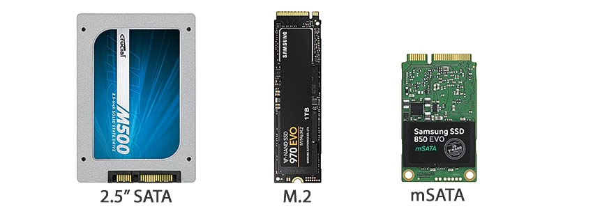
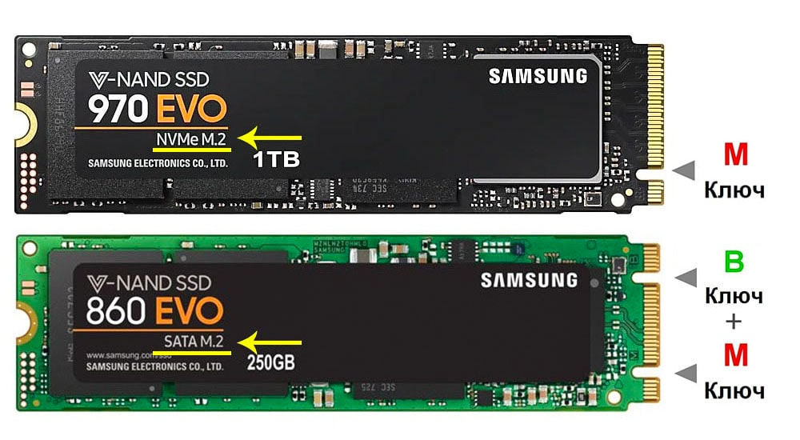
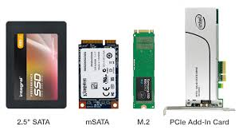
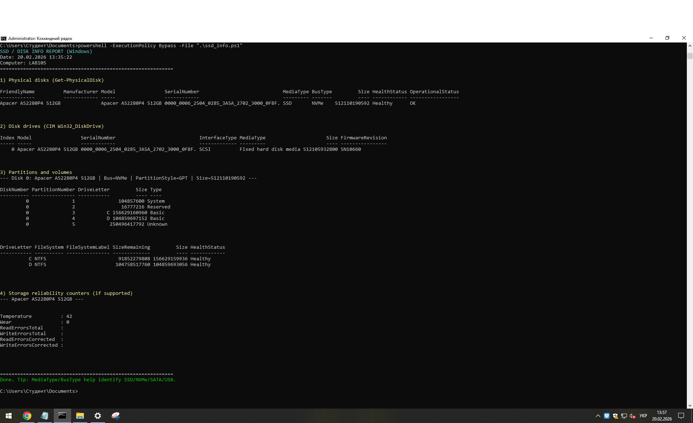

# Тема 5. Типи та характеристики SSD-накопичувачів

## 1) Типи SSD (із зображеннями)

### 1.1 SATA SSD (2.5")
SATA SSD підключається через інтерфейс SATA і найчастіше має форм-фактор 2.5".  
Його швидкість обмежена інтерфейсом SATA (приблизно до 500–550 MB/s), але він добре підходить для оновлення старіших ПК і ноутбуків.  
Перевага — висока сумісність і невисока ціна.



---

### 1.2 NVMe SSD (PCIe, M.2)
NVMe SSD працює через PCIe і зазвичай має форм-фактор M.2.  
Це найшвидший тип SSD для більшості сучасних ПК: швидкості можуть бути в кілька разів більші, ніж у SATA SSD.  
Мінус — деякі моделі можуть нагріватися, тому інколи потрібен радіатор.



---

### 1.3 M.2: важливо не переплутати SATA і NVMe
Форм-фактор M.2 може бути як SATA, так і NVMe — вони виглядають схоже, але працюють по-різному.  
Тому при виборі SSD важливо дивитися не лише на “M.2”, а й на інтерфейс (SATA або NVMe/PCIe).  
У технічних характеристиках це зазвичай вказують як “SATA M.2” або “NVMe PCIe”.



---

## 2) Основні характеристики SSD

- **Обсяг (GB/TB):** визначає, скільки даних можна зберігати.
- **Швидкість читання/запису (MB/s):** впливає на завантаження ОС, ігор та копіювання файлів.
- **IOPS:** важливо для швидкості роботи з великою кількістю дрібних файлів.
- **Тип NAND (TLC/QLC тощо):** впливає на ціну, ресурс і стабільність швидкості.
- **TBW (Terabytes Written):** орієнтовний ресурс запису.
- **Температура та охолодження:** для NVMe може бути важливим у навантаженні.

---

## 3) Скрипт для відображення технічної інформації про встановлений накопичувач (Windows PowerShell)

Нижче наведено скрипт `ssd_info.ps1`, який показує:
- модель диска, серійний номер (якщо доступно),
- тип носія (SSD/HDD) та шину (NVMe/SATA/USB),
- таблицю розділів (GPT/MBR),
- розділи та томи (C:, D: тощо),
- (за підтримки) температуру та wear.

  

> Запуск із CMD (у папці зі скриптом):
> `powershell -ExecutionPolicy Bypass -File ".\ssd_info.ps1"`

```powershell
# ssd_info.ps1

Write-Host "SSD / DISK INFO REPORT (Windows)" -ForegroundColor Cyan
Write-Host ("Date: {0}" -f (Get-Date))
Write-Host ("Computer: {0}" -f $env:COMPUTERNAME)
Write-Host "============================================================"

Write-Host "`n1) Physical disks (Get-PhysicalDisk)" -ForegroundColor Yellow
try {
    Get-PhysicalDisk |
        Select-Object FriendlyName, Manufacturer, Model, SerialNumber, MediaType, BusType, Size, HealthStatus, OperationalStatus |
        Format-Table -AutoSize
} catch {
    Write-Host "Get-PhysicalDisk is not available on this system." -ForegroundColor Red
}

Write-Host "`n2) Disk drives (CIM Win32_DiskDrive)" -ForegroundColor Yellow
Get-CimInstance Win32_DiskDrive |
    Select-Object Index, Model, SerialNumber, InterfaceType, MediaType, Size, FirmwareRevision |
    Format-Table -AutoSize

Write-Host "`n3) Partitions and volumes" -ForegroundColor Yellow
Get-Disk | Sort-Object Number | ForEach-Object {
    $d = $_
    Write-Host ("--- Disk {0}: {1} | Bus={2} | PartitionStyle={3} | Size={4} ---" -f $d.Number, $d.FriendlyName, $d.BusType, $d.PartitionStyle, $d.Size)

    Get-Partition -DiskNumber $d.Number |
        Select-Object DiskNumber, PartitionNumber, DriveLetter, Size, Type |
        Format-Table -AutoSize

    Get-Partition -DiskNumber $d.Number |
        Where-Object { $_.DriveLetter } |
        ForEach-Object { Get-Volume -DriveLetter $_.DriveLetter -ErrorAction SilentlyContinue } |
        Select-Object DriveLetter, FileSystem, FileSystemLabel, SizeRemaining, Size, HealthStatus |
        Format-Table -AutoSize

    ""
}

Write-Host "`n4) Storage reliability counters (if supported)" -ForegroundColor Yellow
try {
    Get-PhysicalDisk | ForEach-Object {
        $pd = $_
        Write-Host ("--- {0} ---" -f $pd.FriendlyName)
        try {
            $rc = Get-StorageReliabilityCounter -PhysicalDisk $pd -ErrorAction Stop
            $rc | Select-Object Temperature, Wear, ReadErrorsTotal, WriteErrorsTotal, ReadErrorsCorrected, WriteErrorsCorrected |
                Format-List
        } catch {
            Write-Host "Reliability counters not available for this disk." -ForegroundColor DarkYellow
        }
        ""
    }
} catch {
    Write-Host "Failed to read reliability counters." -ForegroundColor DarkYellow
}

Write-Host "============================================================"
Write-Host "Done. Tip: MediaType/BusType help identify SSD/NVMe/SATA/USB." -ForegroundColor Green


C:\Users\Студент\Documents>powershell -ExecutionPolicy Bypass -File ".\ssd_info.ps1"
SSD / DISK INFO REPORT (Windows)
Date: 20.02.2026 13:35:22
Computer: LAB105
============================================================

1) Physical disks (Get-PhysicalDisk)

FriendlyName          Manufacturer Model                 SerialNumber                             MediaType BusType         Size HealthStatus OperationalStatus
------------          ------------ -----                 ------------                             --------- -------         ---- ------------ -----------------
Apacer AS2280P4 512GB              Apacer AS2280P4 512GB 0000_0006_2504_0285_3A5A_2702_3000_0FBF. SSD       NVMe    512110190592 Healthy      OK


2) Disk drives (CIM Win32_DiskDrive)

Index Model                 SerialNumber                             InterfaceType MediaType                     Size FirmwareRevision
----- -----                 ------------                             ------------- ---------                     ---- ----------------
    0 Apacer AS2280P4 512GB 0000_0006_2504_0285_3A5A_2702_3000_0FBF. SCSI          Fixed hard disk media 512105932800 SN10660


3) Partitions and volumes
--- Disk 0: Apacer AS2280P4 512GB | Bus=NVMe | PartitionStyle=GPT | Size=512110190592 ---

DiskNumber PartitionNumber DriveLetter         Size Type
---------- --------------- -----------         ---- ----
         0               1               104857600 System
         0               2                16777216 Reserved
         0               3           C 156629160960 Basic
         0               4           D 104859697152 Basic
         0               5            250496417792 Unknown


DriveLetter FileSystem FileSystemLabel SizeRemaining         Size HealthStatus
----------- ---------- --------------- -------------         ---- ------------
          C NTFS                         91852279808 156629159936 Healthy
          D NTFS                        104758517760 104859693056 Healthy


4) Storage reliability counters (if supported)
--- Apacer AS2280P4 512GB ---


Temperature          : 42
Wear                 : 0
ReadErrorsTotal      :
WriteErrorsTotal     :
ReadErrorsCorrected  :
WriteErrorsCorrected :


============================================================
Done. Tip: MediaType/BusType help identify SSD/NVMe/SATA/USB.
